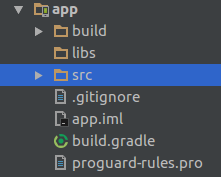

# Android Project Structure Simplified

Switching from making a single file program to multi-file project can be a difficult task. Likewise new Android Developers usually gets confused seeing Android's multi-file project. This guide will help make transition easier by explaining each and every part of the Android Project Structure in detail.

A project which consists of different type of files, requires a build tool to build the project. Build tools are programs that automate the creation of such executable applications from source code\(e.g.apk for android app\). Building incorporates compiling, linking and packaging the code into a usable or executable form.

Various tools like Ninja, Maven, MAKE and Gradle can be used to build different type of projects. Earlier maven was used to build Android applications in Eclipse. Android applications at the OS level are built using MAKE. Generally, now we use Gradle to build Android applications.

Gradle is also a build tool and it configures how an app is built. There are certain tasks which need to be performed to build an Android Application. These tasks include Javac compiling java files, encoding the XML files, compressing images etc. Gradle manages all this build system and performs these necessary tasks.

Now we understand the role of Gradle in building an Android application, we can move to understand the basic project structure.

The basic structure of an Android Application built using Gradle is shown below. It has many folders inside Project folder\(AndroidDemo\), we would study each of them in detail. \('app' folder is explained at the end\)

* **AndroidDemo**

  AndroidDemo is our project name. One project can have more than one application and module. By default, there is only one application in the 'app' folder. You can add more apps in project folder. The reason we want our project to have more than one application is to share data among themselves.

  * **.gradle**

    This is a hidden folder. It is used to store downloaded libraries and Gradle cache. It also contains Snapshots and other automatically generated files. Generally, there is no need to change anything in this folder.

  * **.idea**

    Android Studio is based on IntelliJ by Jetbrain. All IntelliJ IDEs store settings in '.idea' folder of the project. Example if you increase font for a particular file in Android Studio, the font size remains same when you open the file next time. All these types of settings are stored in this folder.

  * **bulid**

    When we build an android app various temporary files are generated like compiled files, compressed files. So these generated files are present in this folder. Build folder contents can be deleted to start a clean build a project.

  * **Gradle**

    

      
    [File Link](./AndroidDemo/gradle/wrapper/gradle-wrapper.properties)

    In Gradle folder, we have a wrapper folder, which has a file for gradle properties. It denotes the version of gradle that is to be used to build the project. Android Studio automatically makes it to the latest version available.

  * **gradle.properties**

    This file has gradle properties needed at the time of execution. Like you can set the RAM limit consumed by Gradle.

  * [**bulild.gradle**](./AndroidDemo/build.gradle)

    We are depending on Gradle plugin to run our project. In this file, Gradle plugin version is mentioned for the whole project. Android Studio version and Gradle plugin version should be same. If you open an earlier project then this version should be changed to match the current Android Studio version.

  * [**settings.gradle**](./AndroidDemo/settings.gradle)

    In the project modules which are needed to be built are listed in this file. By default it only has 'app'.

  * **app**

    This is the default application/module folder named as 'app'. It has all the folders and files associated with our apllication.

    

    * [**build.gradle**](./AndroidDemo/app/build.gradle)

      

      This is the Gradle file pertaining to the module. Gradle files are written in a language known as Groovy. The various components of the file are described below -

      'android' block contains information related to Android compiling. The 'compileSdkVersion' is the version of the API the app is compiled against. This means you can use Android API features included in that version of the API. In this case, it is 26 corresponding to Android Oreo.

      'targetSdkVersion' is the version for which the app has been tested.

      'minSdkversion' is the minimum Android version in which the app will work. It has to do with whether the newer APIs are backward compatible with API level below the specified version.

      'versioncode' is the current version of the app. This should be updated to release an update of the app otherwise play store wouldn't accept the apk. Users cannot see this on the play store.

      'versionName' is the version name displayed to users on play store and it can be changed to anything.

      'dependencies' block contains the external dependencies/modules we want to include in the current module. These are the external libraries which provide extra features to your application. By default appcompat-v7 is included for Appcompat class to back port the material design till SDK version 7. The version 26 should match with compiled SDK version and '+' indicates to automatically use the latest version of the library.

    * **src**

      This folder contains all the source files of the project.  MultiFlavor of the app.

      

      * **androidTest**

        This folder contains the test files written to test android functions.

      * **test**

        This folder contains the test files written to test Java functions.

      * **main**

        This contains the main source code of the application. Whenever an apk is generated it contains source code present in this folder. So this forms the core components of the app.

        

        * [**Android Manifest**](./AndroidDemo/app/src/main/AndroidManifest.xml)

          It is the most important file for an Android App.Every application must have an AndroidManifest.xml file \(with precisely that name\) in its root directory. In an app Java or resource files are optional. Apps that run as service don't have any resource associated. Apps like launcher pack do not have any java files associated with them. But each of them has manifest attached to them.  
            It is necessary to have a manifest for a valid android application.  
            It contains tags like application\(So OS identify it as android application\), package name, label \(Name of application on launcher\)

        * **java**

          This folder contains all the java files of our Android application.

        * **res**

          

          This contains all the resource files required in our application. The filse are logically segregated into their respective folders.

          Images needed in the app should be put in the drawable folder.  
            Images required by the OS associated with our app are put in mipmap eg launcher Icon.

          Layout folder contains the Android XML layout files which can be used in activities or fragment.

          Values folder contains values like colors, dimension, string. These values can be referenced in our app java files.

          We can also create environment specific resource folders. Environments include orientation of the phone, display density etc can be chosen from.  
            Folder name followed by a hyphen followed by a specifier is used to create such folders.  
            Eg. values-land, values defined in this folder would be specific to landscape orientation of the phone. For portrait mode default values in 'values' folder will be used.  
            Specific folders just override the value if the phone is in that specific environment otherwise fall back to the default values.

