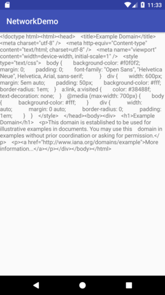

# Android Network Operations

All the network requests have to be performed over a protocol. It can be over HTTP or FTP and this defines the format of the payload of the reuest. Like FTP will have a FTP payload/packet and will not be able to read HTTP payload. Hence, it is important to define a protocol in any network request. We will be using HTTP request.

We need a protocol client to handle a protocol. We will set up an HTTP protocol client to send HTTP requests. This request are sent and the data recieved through the streams.
Now we understand what actually streams are.

**Stream**-> We require streams to read and write data to the files from your program. Whenever our program has to get data from an external source it is Input Stream. Whenever our program has to write data, it is output stream. The streams are always seen w.r.t to your program.

Now the main question is, why do we need streams? Why can't we just simply read all data at once?
There are basically two reasons

1. The speed of the data to your program will be different from the rate at which your program can read. To synchronize this data speed we need streams.

2. We don't have large RAM space. So we can't always read or write a file in the RAM. Only some part of the file must be present, so when we read a file/write, we do it in chunks. And these chunks are what makes the stream.

We also need a buffer to store the file in a local buffer, which when full, data is read from it.

Android performs network related operations on the background thread. Response from the server take variable time and UI thread can't be blocked for that long. So we use AsyncTask to send the network request in the background.

So in Android we will be using all of the above for the network request. We open a URL connection. It gives a InputStream to read bytes from the network and to read data from Stream we use buffered reader.

To make a network request in the app, we need to add permission in the manifest file.

```xml
<uses-permission android:name="android.permission.INTERNET"/>
```

We start by making a AsyncTask. And our downloaded Asynctask will look like

```java
public class DownloadAsyncTask extends AsyncTask<String, Void, String> {


    private TextView tvResult;


    public DownloadAsyncTask(TextView tvResult) {
        this.tvResult = tvResult;
    }


    protected String doInBackground(String... strings) {
        // Some long-running task in backgorund

        URL url = null;
        String result = "";
        try {
            url = new URL(strings[0]);
        } catch (MalformedURLException e) {
            e.printStackTrace();
        }

        HttpURLConnection connection = null;

        try {
            //Sets up HTTP URL connection
            connection = (HttpURLConnection) url.openConnection();
            //Gives the data in form of bytes
            InputStream netInputStream = connection.getInputStream();

            //Converts that byte data using charset
            InputStreamReader isr = new InputStreamReader(netInputStream);

            //Helps read data in chunks
            BufferedReader br = new BufferedReader(isr);

            StringBuilder sb = new StringBuilder();
            String buffer = "";

            while(buffer!=null) {
                sb.append(buffer);
                buffer = br.readLine(); // Returns null after all work
            }

            result = sb.toString();

        } catch (IOException e) {
            e.printStackTrace();
        }
        return result;
    }

    protected void onPostExecute(String result) {
        tvResult.setText(result);

    }
}
```

We call this AsyncTask from our activity like

```java
new DownloadAsyncTask((TextView) findViewById(R.id.tvResult))
                .execute("http://example.com");
```


