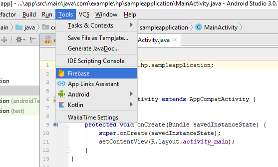
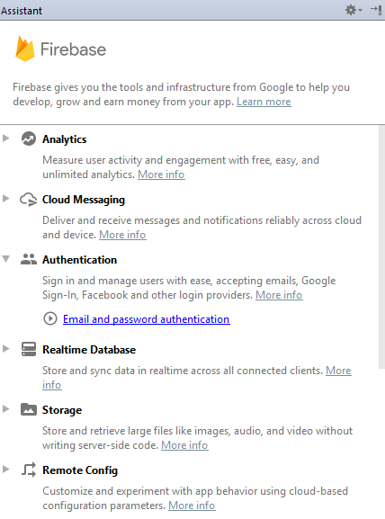
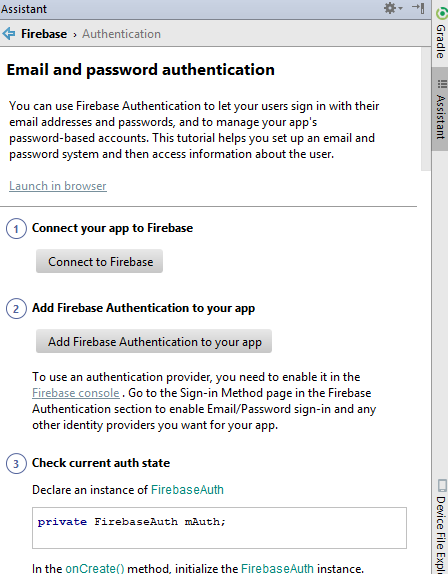
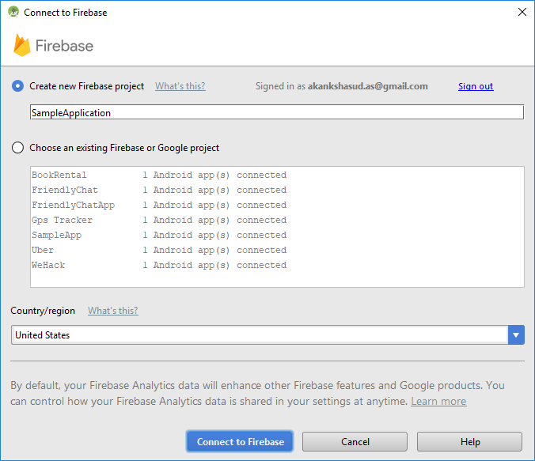
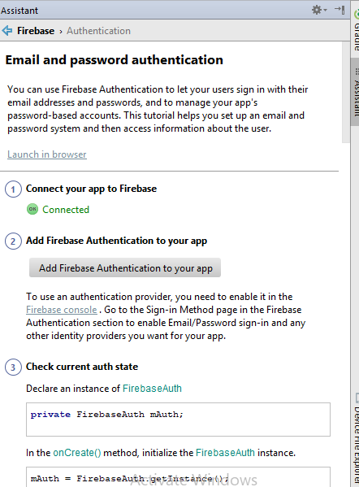

# Adding Firebase Support

Firebase support can be added very easily from the android studio itself.

Select Tools from menubar and click on Firebase.

This opens up the firebase assistant. Select any feature from the list that you wish to explore.

In this new window, click on the Connect to Firebase option.

In the dialog box that pops up, create a new Firebase project and click on connect to fIrebase option.

Next, Add the Firebase authentication to your app and select the Accept Changes option (to setup the dependencies correctly) in the following dialog box.

     
With this, the firebase setup is complete.

