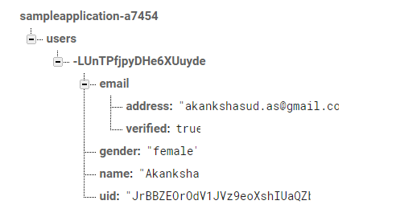

# Realtime Database

The Firebase Realtime Database is a cloud-hosted database. Data is stored as JSON and synchronized in realtime to every connected client. When you build cross-platform apps with our iOS, Android, and JavaScript SDKs, all of your clients share one Realtime Database instance and automatically receive updates with the newest data.

Data in Firebase is stored in the form of a JSON tree:

 
In order to begin using the Firebase database, do the initial steps as explained above.

## Writing to the database

Next, in order to write to the database, get a reference to the database:
 
 
Now, in order to add the data first create a new node by using the push method, The push method assigns a unique key to the data value. Then obtain that key using .key and finally push your data at the key node by passing the data as a parameter to the setValue method
 
If the data passed is an object, then the contents of your object are automatically mapped to child locations in a nested fashion. 
You can also update a particular attribute of the object without having to rewrite the whole object. This can be done using the setValue method for the child node.

### Offline data
Every application that is connected to the Firebase, maintains its own local version of the data. In fact, the data that is pushed gets written to the local server first and is then synchronized with the server.
Therefore, the app will remain responsive even if the internet connection is not available at that particular moment. When the connection is re-established, then the client is synced with the current state of the server.
