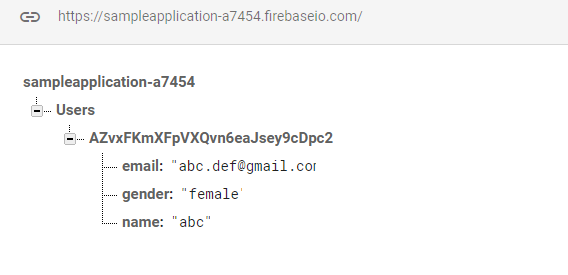
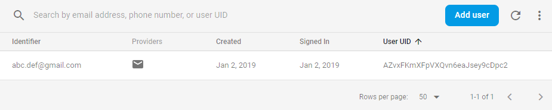
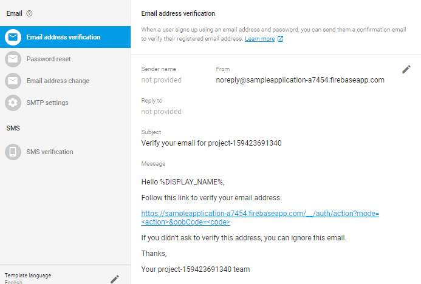
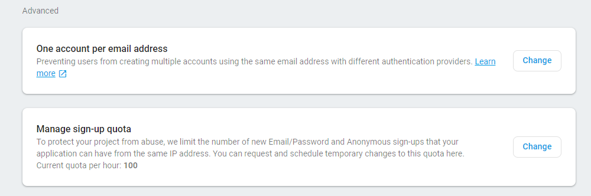

# Authentication

Firebase provides easy to use methods to implement user authentication functionalities.

This section is about registering new users and storing their data in the realtime .
We will start from adding new users to database.

After correctly setting up the dependencies, create a new class having all the user details in the form of attributes of the class.

```
class User (n:String, e:String, g:String){

    var name: String = n
    var email: String = e
    var gender: String = g
}
```

Create a sign-up page asking from the user all the necessary details. 


Next, process all the inputs and check the entered fields for not being null and having the correct values (valid email, unique username, password with minimum length etc.)

Declare the following variables and later in the onCreate method, go on to initialize them.

```
private var mDatabaseReference: DatabaseReference? = null
private var mDatabase: FirebaseDatabase? = null
private var mAuth: FirebaseAuth? = null
```

```
mDatabase = FirebaseDatabase.getInstance()
mDatabaseReference = mDatabase!!.reference!!.child("Users")
mAuth = FirebaseAuth.getInstance()
```

Finally, using the createUserWithEmailAndPassword , create a new account by passing in the email and password as parameters

```
mAuth!!.createUserWithEmailAndPassword(email!!, password!!)
                .addOnCompleteListener(this) { task ->
                    if (task.isSuccessful) {
                        // Sign in successful
                        Toast.makeText(this, "Account created successfully.", Toast.LENGTH_SHORT).show()
                        //update user profile information
                        mAuth2 = mAuth
                        val user_id = mAuth2!!.getCurrentUser()!!.uid
                        val current_user_db =  mDatabaseReference!!.child(user_id)
                        val user = User(name, email, gender)
                        current_user_db.setValue(user)

                    } else {
                        // If sign in fails, display a message to the user.
                        Toast.makeText(this, "SignUp failed.", Toast.LENGTH_SHORT).show()
                    }
                }
```

In the above code, a new key is added in the database under the head “Users” using the push() keyword and is returned and stored in variable key.

Create an object of user class passing the details of the form along with key as constructor parameters .

Lastly, set the value of the obtained key using setValue.

This will create the following JSON structure in Firebase Console.



And this is the Authentication dashboard: 



### Verification for correct Email

In order to verify that the E-mail provided by the user is correct or not, a verification E-mail can be sent to the user with the help of the following code: 

```
val mUser = mAuth!!.currentUser:
muser!!.sendEmailVerification()
        ?.addOnCompleteListener { task ->
            if (task.isSuccessful) {
                Toast.makeText(this, "Verification email sent to " + mUser.getEmail(), Toast.LENGTH_SHORT).show()
            } else {
              Toast.makeText(this, "Failed to send verification email", Toast.LENGTH_SHORT).show()
            }
        }
 ```
 
## Signing-in

The following snippet of code is for signing in:

```
mAuth!!.signInWithEmailAndPassword(email!!, password!!)
        .addOnCompleteListener(this) { task ->
            if (task.isSuccessful) {
                // Sign in success, update UI with the signed-in user's information
                Log.d(TAG, "Logged in successfully")
                val user = auth.currentUser
                updateUI(user)
            } else {
                // If sign in fails, display a message to the user.
                Log.d(TAG, "signIn failed")
                Toast.makeText(this, "Authentication failed.",Toast.LENGTH_SHORT).show()
                updateUI(null)
            }
        }
 ```
 
 
 Similar to the process of signing up, create an activity asking for the email and  password of the user, both the strings are then passed on to the signInWithEmailAndPassword method as parameters. The addOnCompleteListener checks the success of the logging In process.
 
## Resetting password

Firebase provides a simple API which allows users to reset their password
 
The steps are similar to that of signing-in, take the email for resetting the password from the user and pass it on as a parameter to the sendPasswordResetEmail and add an addOnCompleteListener to the code to check if the email id entered by the user exists in the database or not.

The rest of the steps will be handled by Firebase itself.

```
mAuth!!.sendPasswordResetEmail(emailAddress)
        .addOnCompleteListener { task ->
            if (task.isSuccessful) {
                Log.d(TAG, "Email sent.")
            } else {
              Log.d(TAG, "Email sending failed")
            }
        }
```

## Signing Out

The last part of the authentication process is signing out, it can be done with a single line of :
```
mAuth.signOut()
```
* Note: *

The language of the verification E-mail that is sent to the user for password reset or for any other similar operation can be changed from the following section of the Authentication part of Firebase:
 
 

Also, from the Advanced part of the SignIn methods of the Authentication section, you can prevent multiple logins from the same Email address and also restrict the number of account creations from the same IP address.

 


