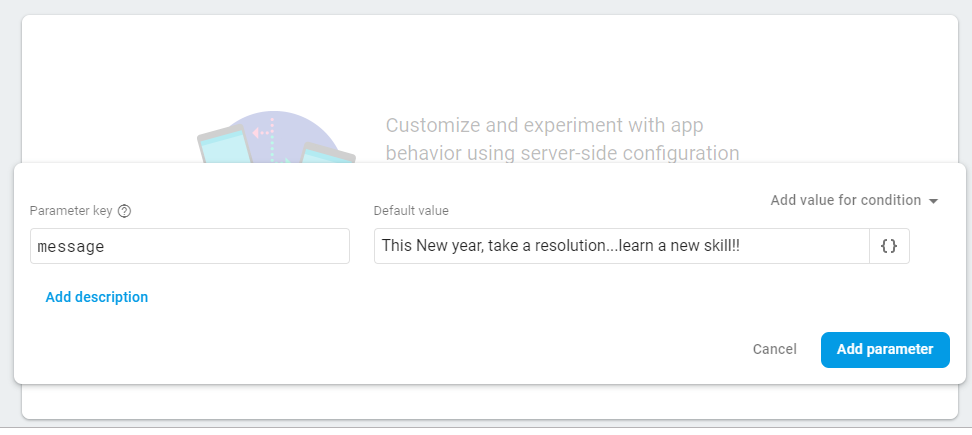

# Remote Configuration

Firebase remote configuration is a service that allows the developers to publish changes to the app, without having to release a new version of it. By using it, you can reliably modify the looks and behaviors of your apps across your entire user base.

Consider the scenario that during the Christmas season, you want your app to have a red theme or if the users of your app find the font size too small and you want to change it, then for such minor changes releasing a new version of the app makes no sense. In cases, like these firebase remote configuration comes to our rescue.

Also, there are times when you aren’t sure of a particular update of the application, so firebase allows you to roll out the new version of the app to a certain section of the users to understand their response and take your decision accordingly.

In the following tutorial, we will change the message with the help of remote configuration.

Firstly, setup the firebase as explained in the previous section.

Next, open the firebase console -> find remote configuration in the Grow section and click on **Add your first parameter** to get started.


Type in the value of the parameter along with default value and add this parameter (Using this default parameter you can control the message).



Declare an object of FirebaseRemoteConfig.

```
private lateinit var mFirebaseRemoteConfig: FirebaseRemoteConfig
```

```
 mFirebaseRemoteConfig = FirebaseRemoteConfig.getInstance()
 ```
 
Use the following code to fetch the values from firebase and publish the update.

```
val cacheExpiration: Long = 0;
        mFirebaseRemoteConfig.fetch(cacheExpiration)
                .addOnCompleteListener(this) { task ->
                    if (task.isSuccessful) {
                        // After config data is successfully fetched, it must be activated before newly fetched
                        // values are returned.
                        mFirebaseRemoteConfig.activateFetched()
                        Toast.makeText(this, "Fetch Succeeded " + mFirebaseRemoteConfig.getString("message"),
                                Toast.LENGTH_SHORT).show()
                    } else {
                        Toast.makeText(this, "Fetch Failed",
                                Toast.LENGTH_SHORT).show()
                    }
                    update()
                }
```
 
You can now control the value of the parameter from firebase and publish the changes you just made.


Also, you can restrict the application of change to a fewer section of  audience by applying any condition.


