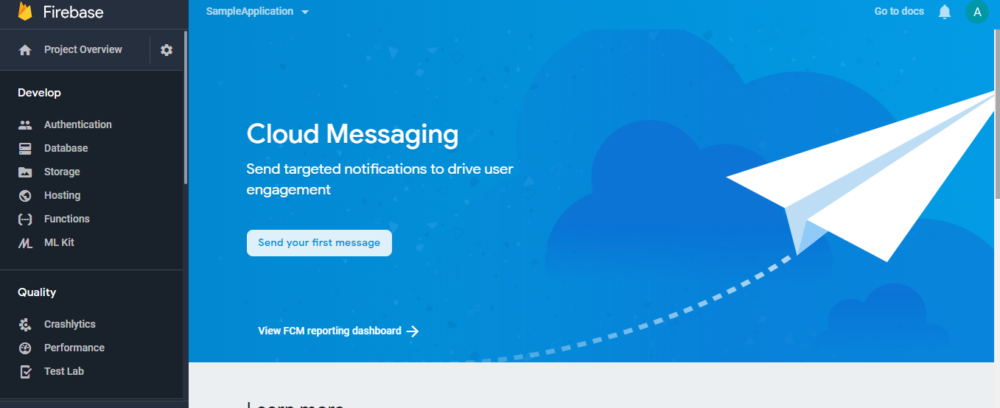
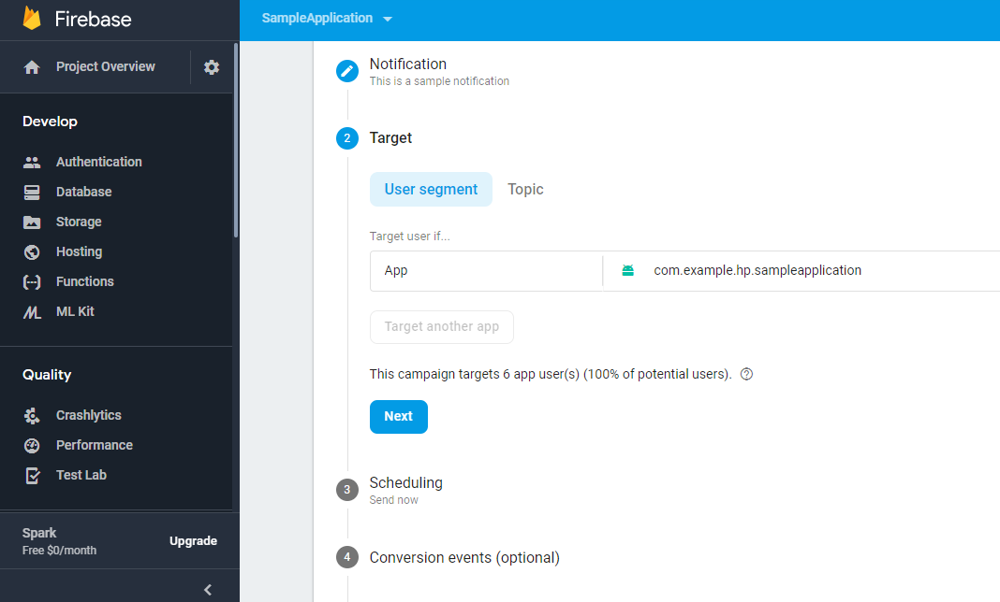

# Push Notifications

Firebase Cloud Messaging(FCM) is a cross-platform messaging solution that delivers the messages at absolutely no cost and is etremely reliable. It is an advancement to the GCM which is completely free of cost, is more developer as friendly as it involves no coding at the server end, is faster and most importantly it is absolutely free of cost. Also, FCM is capable of transferring a payload of upto 4KB to the client apps.

The primary use cases of FCM are:
- Retentation and engagement enhancement of users
- Notyfing client about any new update
- Instant messaging
- Sending response from client apps back to the server

## Types of Messages
- <b> Notification Messages </b>: A typical notification message contains title, message and icon. These messages can be sent easily using Firebase UI. The notification pops up if the app is in background. 

```
{
  "message":{
    "token":"bk3RNwTe3H0:CI2k_HHwgIpoDKCIZvvDMExUdFQ3P1...",
    "notification":{
      "title":"Portugal vs. Denmark",
      "body":"great match!"
    }
  }
}
```

- <b> Data Messages </b>: Thses messages are supposed to be handled by the client app. These are used when some data is to be sent along. However, these cannot be sent via Firebase UI, a server side logic is required. 

```
{
  "message":{
    "token":"bk3RNwTe3H0:CI2k_HHwgIpoDKCIZvvDMExUdFQ3P1...",
    "data":{
      "Nick" : "Mario",
      "body" : "great match!",
      "Room" : "PortugalVSDenmark"
    }
  }
}
```

- <b> Messages with both notification and data payload </b>: A message can also contain both notification and data payload. When these kinds of messages are sent, it will be handled in two scenarios depending upon app state (background/foreground). For these messages, we can use both notification and data keys.

When in the background — The notification is received in the notification tray and further cationis taken only when the notification is tapped on.

When in the foreground — App receives a message object with both payloads available.

```
{
  "message":{
    "token":"bk3RNwTe3H0:CI2k_HHwgIpoDKCIZvvDMExUdFQ3P1...",
    "notification":{
      "title":"Portugal vs. Denmark",
      "body":"great match!"
    },
    "data" : {
      "Nick" : "Mario",
      "Room" : "PortugalVSDenmark"
    }
  }
}
```

Another major attraction about FCM is that it allows sending messages in groups to all the devices, to a section of devices who have subscribed to a certain topic, or to individual devices.

## How to Code??

- Firstly, integrate FCM as explained in the previous section.
- Add this to the manifest file
```
<service android:name=".java.MyFirebaseMessagingService">
    <intent-filter>
        <action android:name="com.google.firebase.MESSAGING_EVENT" />
    </intent-filter>
</service>
```
- ### Sending out message to a single device
In order to connect with a particular client app, the registration number is required that is generated by the FCM SDK, that is allocated to the app at the time of initial setup.
```
FirebaseInstanceId.getInstance().instanceId
        .addOnCompleteListener(OnCompleteListener { task ->
            if (!task.isSuccessful) {
                Log.w(TAG, "failed", task.exception)
                return@OnCompleteListener
            }

            // Get new Instance ID token
            val token = task.result?.token

            
            val msg = getString(R.string.msg_token_fmt, token)
            Log.d(TAG, msg)
            Toast.makeText(baseContext, msg, Toast.LENGTH_SHORT).show()
        })
   ```
However, the problem is that due to multiple reasons, the token can change therefore it is necessary that the most recent one is taken.
```
override fun onNewToken(token: String?) {
    Log.d(TAG, "Refreshed token: $token")
    sendRegistrationToServer(token)
}
```
This method is invoked whenever a new token is generated.
- After this, the client app is ready
- Next, open the Firebase Console and start with the notifications.


- After filling out the required fields appropriately click on `Test for device`.

      
- ### Sending out notifications to multiple devices

- This is done with the help of topic messaging, which allows you to send a message to multiple devices who have opted in to a particular topic.

- Following is the code which is used to subscribe to a particular topic. It can be attached to onClickListener of a View or to onItemClickListener of a list.

```    
    FirebaseMessaging.getInstance().subscribeToTopic("weather")
        .addOnCompleteListener { task ->
            var msg = getString(R.string.msg_subscribed)
            if (!task.isSuccessful) {
                msg = getString(R.string.msg_subscribe_failed)
            }
            Log.d(TAG, msg)
            Toast.makeText(baseContext, msg, Toast.LENGTH_SHORT).show()
        }
```
- Next, open the firebase console and fill in the topic whose subscribers you wish to notify.


- With this, we are done with sending out the notifications. The next part is about receiving the messages:
```
override fun onMessageReceived(remoteMessage: RemoteMessage?) {
   
    // Check if message contains a data payload.
    remoteMessage?.data?.isNotEmpty()?.let {
        Log.d(TAG, "Message data payload: " + remoteMessage.data)

        if (/* Check if data needs to be processed by long running job */ true) {
            // For long-running tasks (10 seconds or more) use Firebase Job Dispatcher.
            scheduleJob()
        } else {
            // Handle message within 10 seconds
            handleNow()
        }
    }

    // Check if message contains a notification payload.
    remoteMessage?.notification?.let {
        Log.d(TAG, "Message Notification Body: ${it.body}")
    }
}
```
- Lastly, monitor the impact of your notification on the dashboard.



  


