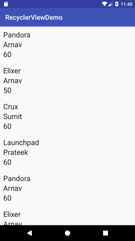

# RecyclerView

Many apps need to display user-interface elements based on large data sets, or data that frequently changes. For example, a music app might need to display information about thousands of albums, but only a dozen of those albums might be on-screen at a time. If the app created UI widgets for each of those albums, the app would end up using a lot of memory and storage, potentially making the app slow and crash-prone. On the other hand, if the app created UI widgets each time a new album scrolled onto the screen and destroyed the widgets when it scrolled off, that would also cause the app to run slowly, since creating UI objects is a resource-intensive operation.

To address the above problem Recycler View is used to show list items on the Android. It is similar to ListView in terms of layout on the screen. But has a major difference in the way both are implemented.

In ListView we have an option to use ViewHolder pattern for good performance. But RecyclerView enforces us to recycle the views created on the screen. Like if 5 items are being displayed on your screen, then only 7 items will be in the memory(one extra above and below the screen). When user scrolls, the views are recycled by binding item with different data.

Also, in ListView it is optional to uses ViewGroup containers but in RecyclerView, the layout has to be inflated inside the container. This helps as the shape of the containers can be modified to get different types of list. The RecyclerView list can be horizontal, vertical etc.

To use RecyclerView we need to follow 6 steps which are explained in detail below :-


1. Add RecyclerView support library to the gradle build file
    ```java
    compile 'com.android.support:recyclerview-v7:26.1.0'
    ```

2. Each list Item needs a data source. We will create a Course model/POJO class as our data source
    ```java
    public class Course {
        private String name, instructor;
        private int batchStrength;

        public Course(String name, String instructor, int batchStrength) {
            this.name = name;
            this.instructor = instructor;
            this.batchStrength = batchStrength;
        }

        public String getName() {
            return name;
        }

        public String getInstructor() {
            return instructor;
        }

        public int getBatchStrength() {
            return batchStrength;
        }
    }
    ```

3. Add RecyclerView to your activity/fragment XML file
    ```xml
    <android.support.v7.widget.RecyclerView
        android:id="@+id/rvCourseList"
        android:layout_width="match_parent"
        android:layout_height="match_parent" />
    ```

4. Now we need to create a custom XML row item layout which will be used as the layout for each row. Go to layout folder in res, right click and select New -> resource Layout file. In demo project it is named as list_item_course.xml
    ```xml
    <?xml version="1.0" encoding="utf-8"?>
    <LinearLayout xmlns:android="http://schemas.android.com/apk/res/android"
        android:layout_width="match_parent"
        android:layout_height="wrap_content"
        android:layout_margin="10dp"
        android:orientation="vertical">


        <TextView
            android:id="@+id/tvCourseName"
            android:layout_width="match_parent"
            android:layout_height="wrap_content"
            android:text="text1"
            android:textAppearance="@android:style/TextAppearance.Large" />

        <TextView
            android:id="@+id/tvInstName"
            android:layout_width="match_parent"
            android:layout_height="wrap_content"
            android:text="text2"
            android:textAppearance="@android:style/TextAppearance.Large" />

        <TextView
            android:id="@+id/tvBatchStrength"
            android:layout_width="match_parent"
            android:layout_height="wrap_content"
            android:text="text3"
            android:textAppearance="@android:style/TextAppearance.Large" />
    </LinearLayout>
    ```

5. Now we make the RecyclerView adapter. We make a java class lets say CourseAdapter. We extend RecyclerView.Adapter but it needs a ViewHolder class. So inside CourseAdapter, we create ViewHolder class which extends from RecyclerView.ViewHolder. Then send use ViewHolder class in our CourseAdapter class.
We have to implement three methods as follows -
  * **public ViewHolder onCreateViewHolder(ViewGroup parent, int viewType)**

    This is called when the layouts are first time created on the screen. Item layout is inflated inside the parent container and ViewHolder is created for this view, whose object needs to be returned.

  * **public void onBindViewHolder(ViewHolder holder, int position)**

    This is called to bind our views with the data. method uses the view holder's position to determine what the contents should be. It gets the view holder of the layout item which populates data into the item through holder


  * **public int getItemCount()**

    This returns the number of list items.

    We make constructor for Adapter with context(needed to inflate the view) and arrayList which acts as a data source.

    The final code of adapter is as below.
    ```java
    public class CourseAdapter extends RecyclerView.Adapter<CourseAdapter.ViewHolder>{

        private Context context;
        private ArrayList<Course> courseList = new ArrayList<>();

        public CourseAdapter(Context context, ArrayList<Course> courseList) {
            this.context = context;
            this.courseList = courseList;

        }

        @Override
        public ViewHolder onCreateViewHolder(ViewGroup parent, int viewType) {

            //inflate has three parameters, layout to inflate, container in which it needs to be inflated
            // attach to root layout, should be false
            View v = LayoutInflater.from(context).inflate(R.layout.list_item_course, parent, false);
            return new ViewHolder(v);  // returns a viewHolder object
        }

        @Override
        public void onBindViewHolder(ViewHolder holder, int position) {
            //Get the desired data
            String courseName = courseList.get(position).getName();
            String instructorName = courseList.get(position).getInstructor();
            int batchStrength = courseList.get(position).getBatchStrength();

            //Binding the data with help of viewholder
            holder.tvCourseName.setText(courseName);
            holder.tvInstructorName.setText(instructorName);
            holder.tvBatchStrength.setText(String.valueOf(batchStrength));

        }

        @Override
        public int getItemCount() {
            return courseList.size();
        }

        // Provide a direct reference to each of the views within a data item
        public class ViewHolder extends RecyclerView.ViewHolder{


            TextView tvCourseName, tvInstructorName, tvBatchStrength;

            // findviewbyid is costly operation so we do it only once for each view which are recycled
            public ViewHolder(View itemView) {
                super(itemView);

                tvCourseName = itemView.findViewById(R.id.tvCourseName);
                tvInstructorName = itemView.findViewById(R.id.tvInstName);
                tvBatchStrength = itemView.findViewById(R.id.tvBatchStrength);
            }
        }
    }
    ```
6. Finally we need to set Adapter on RecyclerView in Activtiy like below
    ```java
    RecyclerView rvCourseList = findViewById(R.id.rvCourseList);
    // Linear Layout Manager for item =s in row form
    rvCourseList.setLayoutManager(new LinearLayoutManager(this));
    //getCourseList gives ArrayList of our model class Courses
    rvCourseList.setAdapter(new CourseAdapter(this, getCourseList()));
    ```

Screen will look like as


